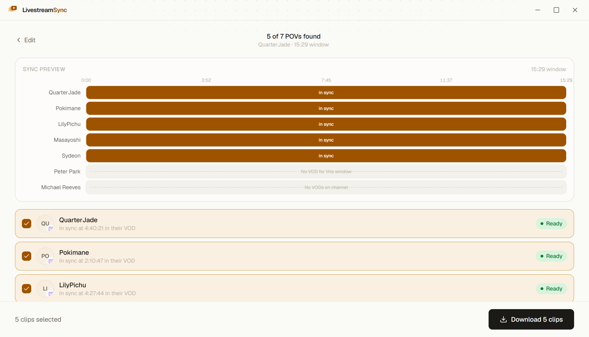
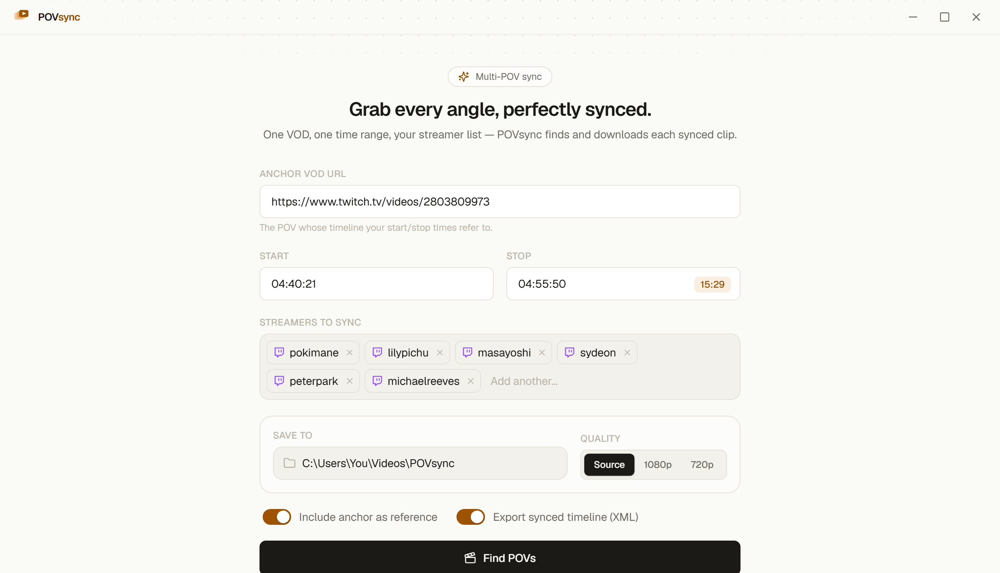
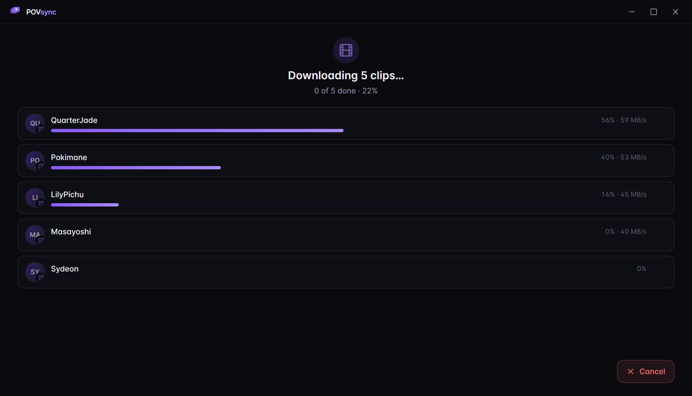
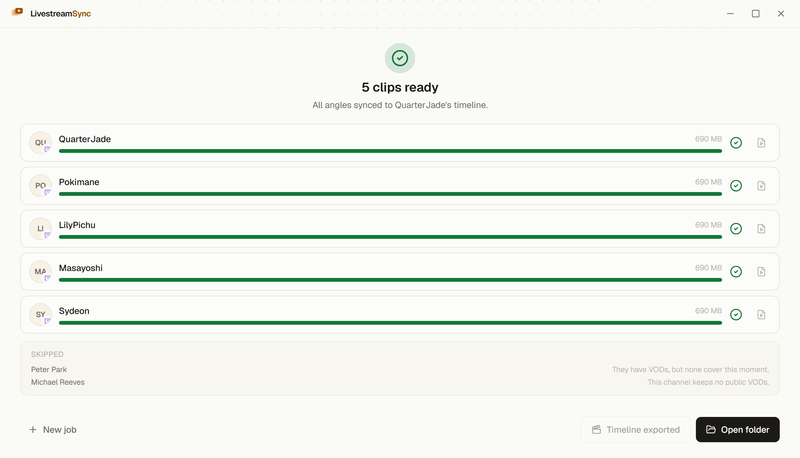

<div align="center">

# LivestreamSync

### Grab every angle, perfectly synced.

One VOD link, one time range, your streamer list — LivestreamSync finds and downloads
each collaborator's **time-aligned multi-POV clip**, plus a **ready-to-edit
Premiere / Resolve timeline** you drop straight into your edit.

<br>

<a href="https://github.com/Nicolaysj/livestreamsync/releases/latest/download/LivestreamSync-Setup.exe">
  
</a>
&nbsp;
<a href="https://github.com/Nicolaysj/livestreamsync/releases/latest/download/LivestreamSync-arm64.dmg">
  
</a>

<sub>Windows 10/11 · macOS (Apple Silicon) · free & open source · installs everything it needs · no account required</sub>

<br><br>

[](https://github.com/Nicolaysj/livestreamsync/releases/latest)
[](https://github.com/Nicolaysj/livestreamsync/releases)
[](LICENSE)

<br>



</div>

---

## What it does

You're editing a collab, a watch party, a podcast, a raid — anything where several
people streamed the **same moment** from their own POV. Normally you'd hunt down each
person's VOD, scrub to find the exact spot, trim it, and line everything up by hand.

LivestreamSync does all of that for you. Give it:

1. **One anchor VOD** — a single streamer's Twitch or YouTube recording.
2. **A start and stop time** in that anchor's own timeline (e.g. `04:40:21 → 04:55:50`).
3. **A list of streamers** who were live at the same time.

It finds each person's VOD that was live during that same real-world window, downloads
**only that slice** at the quality you pick, lines every clip up to the anchor, and drops
them in a folder — with an optional timeline you import straight into your editor.

> A streamer who wasn't live, kept no VOD, or is subscriber-only is reported with a clear
> reason and simply skipped. One miss never breaks the run — the rest still download.

## Get started in 3 steps

| | |
|---|---|
| **1. Download & install** | Grab the [Windows installer](https://github.com/Nicolaysj/livestreamsync/releases/latest/download/LivestreamSync-Setup.exe) or the [macOS disk image](https://github.com/Nicolaysj/livestreamsync/releases/latest/download/LivestreamSync-arm64.dmg). Windows sets up in one click; on macOS, drag the app into Applications (first launch needs one extra step — see [Requirements & notes](#requirements--notes)). Nothing else to install. |
| **2. Fill in three things** | Paste the anchor VOD URL, type your start/stop times, and add the streamers you want. Pick a quality and a folder. Hit **Find POVs**. |
| **3. Review & download** | See exactly how each angle lines up, untick anyone you don't need, and click **Download clips**. Tick *Export synced timeline* to get a Premiere/Resolve project too. |

<div align="center">



</div>

## Why it's nice

- **Twitch *and* YouTube** — mix both in one job. A collaborator can carry a Twitch handle, a YouTube channel, or both.
- **Only downloads what you need** — it fetches just your time slice at Source / 1080p / 720p, so it's fast even on multi-hour VODs.
- **Nothing else to install** — a verified copy of `yt-dlp` and `ffmpeg` ships inside the app.
- **See the sync before you commit** — a visual lane chart shows where every POV lines up, who joined late, and who has no coverage.
- **One miss doesn't sink the run** — each streamer downloads independently with live progress and speed; failures are reported, not fatal.
- **Drop-in timeline** — optional FCP7-XML export puts every angle on its own track at the right offset, and imports into **both** Adobe Premiere Pro and DaVinci Resolve.
- **Remembers your crew** — save frequent collaborators to a roster and add them with one click.

## How the sync works

LivestreamSync lines clips up by **wall-clock time** — the real-world moment each VOD was being
streamed. Twitch matches are tight (anchored on the broadcast's publish time); YouTube
matches are coarser and flagged with a `~` in the app, since YouTube only exposes an
approximate start time. There's no manual nudging and no audio-waveform step — it's all
driven by each platform's own timestamps, which is what makes mixed Twitch + YouTube
timelines line up.

The result is a folder of trimmed `.mp4` clips (padded a few seconds on each side) plus,
optionally, a single `LivestreamSync_timeline.xml` you import into your NLE.

## Requirements & notes

- **Windows 10/11, or macOS on Apple Silicon (M1 or newer).** Intel Macs aren't supported yet.
- **Windows SmartScreen:** the app isn't code-signed yet, so Windows may show a blue
  *"Windows protected your PC"* prompt on first run. Click **More info → Run anyway**.
- **macOS Gatekeeper:** the macOS app isn't notarized yet, so the first launch is blocked.
  Either **right-click (or Control-click) the app → Open**, then click **Open** in the dialog —
  or run this once in Terminal to clear the quarantine flag:
  ```bash
  xattr -dr com.apple.quarantine /Applications/LivestreamSync.app
  ```
  Because it's unsigned, macOS can't auto-*install* updates — but the app still checks GitHub
  on launch and **notifies you when a newer version ships** (a one-time notification plus a dot
  on the title-bar updates menu); "Check for updates" then opens the
  [releases page](https://github.com/Nicolaysj/livestreamsync/releases/latest) to download it.
  Code signing + notarization (for true in-app updates) are planned — see the [roadmap](docs/DESIGN.md).
- **Responsible use.** LivestreamSync is an editing tool for creators working with their own and
  their collaborators' content. It respects platform authentication (no DRM or entitlement
  bypass — subscriber-only content is skipped, not cracked) and keeps everything local. You
  are responsible for having the rights to anything you download, edit, and publish.
  Not affiliated with Twitch, YouTube, or any streamer.

---

## For developers

LivestreamSync is open source (MIT) and contributions are welcome — the quick start is below,
and the architecture & roadmap live in **[docs/DESIGN.md](docs/DESIGN.md)**.

**Stack:** Electron + Vite + React + TypeScript, with a headless TypeScript engine that
also runs from a CLI. Bundled `ffmpeg` and auto-updating `yt-dlp`. Third-party
components are listed in [NOTICE](NOTICE).

```bash
npm install
npm run dev        # the full Electron app, hot-reload
npm run dev:web    # just the UI in a browser (uses a built-in mock)
```

Found a bug or want a feature? [Open an issue](https://github.com/Nicolaysj/livestreamsync/issues).
